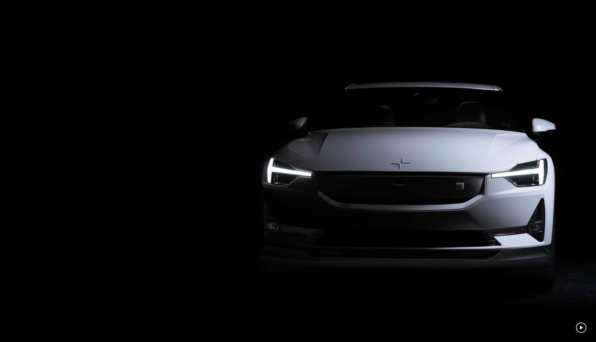

> ---
> ## 📚 Presets
>
> For downloading of presets and information on how to use them, consult [this guide](/docs/guides/presets/README.md).
> ---

# VideoAutoplay

This atom can be used as background or in a section where the first frame of the video is visible until the video is loaded.
The background video follows the viewheight of the viewport and horizontally it extends to the fullwidth of the container element.

Having the smallest file size possible is recommended. Experiment with different bitrate values and consider shortening the video if a desirable image quality cannot be attained within the file size threshold.

Strive to create a video with about 2 or 3 clips max, keeping the edit not too fast-paced.

Ensure that the Pause button positioned in the right bottom corner passes the accessibility tests by adjusting the video to be either dark or light enough in the specific areas.

Video is autoplayed and should be exported without an audio track.

### Video Autoplay

VideoAutoplay
Storybook: https://storybook-dev.polestar.com/polestar-www/?path=/story/atoms-videoautoplay--as-background

### Video Autoplay With Last Frame

Video is autoplayed (is autoplayed once) and should be exported without an audio track. The last frame of the video is visible after the video has played once. It has no Pause Button.

VideoAutoplay
Storybook: https://storybook-dev.polestar.com/polestar-www/?path=/story/atoms-videoautoplaywithlastframe--as-background

---

### Resolution and aspect ratio per device

| Device  | Aspect ratio | Size        | File size threshold                   | Duration                    | Format | Autoplay | Audio |
| ------- | ------------ | ----------- | ------------------------------------- | --------------------------- | ------ | -------- | ----- |
| Desktop | 16:9         | 1920x1080px | 5-10MB, preferably in the lower range | Preferably under 10 seconds | .mp4   | Yes      | No    |
| Tablet  | 4:5          | 960x1200px  | 5-10MB, preferably in the lower range | Preferably under 10 seconds | .mp4   | Yes      | No    |
| Mobile  | 9:16         | 774x1376    | 5-10MB, preferably in the lower range | Preferably under 10 seconds | .mp4   | Yes      | No    |

### TBD:

> Because this video will scale based on viewport height we should consider adding an additional video for large desktops,
> for example 1440p. On a 1440p displays the video will currently stretch beyond the current desktop resolution,
> causing it to become blurry.
