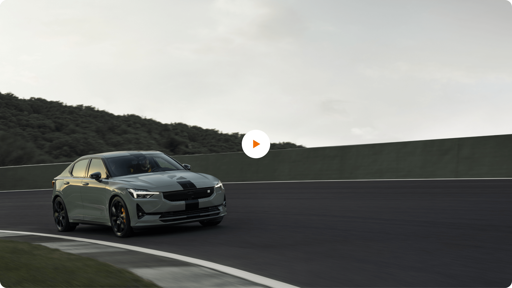

> ---
> ## 📚 Presets
>
> For downloading of presets and information on how to use them, consult [this guide](/docs/guides/presets/README.md).
> ---

# FullScreenModal

At the moment this component only supports a single video.
With this in mind we've opted for a resolution of `1920x1080px`, since it gives us the best balance in quality and performance for the different devices.

## 

<!--
FullScreenModal
Storybook: http://localhost:6006/?path=/story/organisms-fullscreenmodal--default
-->

| Device  | Aspect ratio | Size        | File size threshold                      | Duration                    | Format | Autoplay | Audio    |
| ------- | ------------ | ----------- | ---------------------------------------- | --------------------------- | ------ | -------- | -------- |
| Desktop | 16:9         | 1920x1080px | No more than 15MB per minute of playback | Preferably under 10 seconds | .mp4   | Yes      | Optional |
