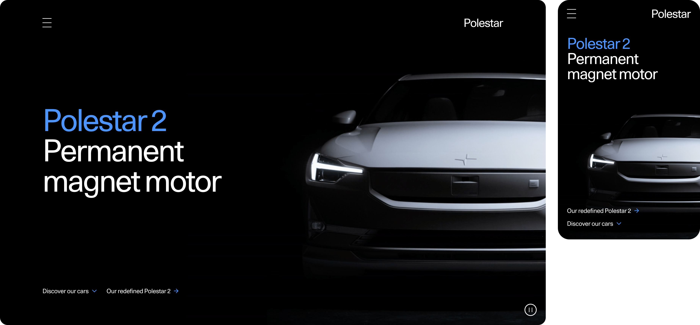

> ---
> 
> ## 📚 Presets
> 
> For downloading of presets and information on how to use them, cosult [this guide](/docs/guides/presets/README.md).
> 
> ---

# HeroHomeCampaign

Having the smallest file size possible is recommended. Experiment with different bitrate values and consider shortening the video if a desirable image quality cannot be attained within the file size threshold.

Strive to create a video with about 2 or 3 clips max, keeping the edit not too fast-paced.

Depending on the negative space of the asset, the title can be displayed in one of the following 3 positions: top, center or bottom. Please be aware that it is currently not possible to choose a different position for each breakpoint.

Ensure that the copy passes the accessibility tests by adjusting the video to be either dark or light enough in the specific areas.

Video is autoplayed and should be exported without an audio track.

---

<!--
HeroHomeCampaign
Storybook: http://localhost:6006/?path=/story/organisms-herohomecampaign--default-story
-->

### Resolution and aspect ratio per device

| Device  | Aspect ratio | Size        | File size threshold                   | Duration                    | Format | Autoplay | Audio | Preset        |
| ------- | ------------ | ----------- | ------------------------------------- | --------------------------- | ------ | -------- | ----- | ------------- |
| Desktop | 16:9         | 1920x1080px | 5-10MB, preferably in the lower range | Preferably under 10 seconds | .mp4   | Yes      | No    | [Download](#) |
| Tablet  | 4:5          | 960x1200px  | 5-10MB, preferably in the lower range | Preferably under 10 seconds | .mp4   | Yes      | No    | [Download](#) |
| Mobile  | 9:16         | 774x1376    | 5-10MB, preferably in the lower range | Preferably under 10 seconds | .mp4   | Yes      | No    | [Download](#) |

---

### TBD:

> Because this video will scale based on viewport height we should consider adding an additional video for large desktops,
> for example 1440p. On a 1440p displays the video will currently stretch beyond the current desktop resolution,
> causing it to become blurry.
