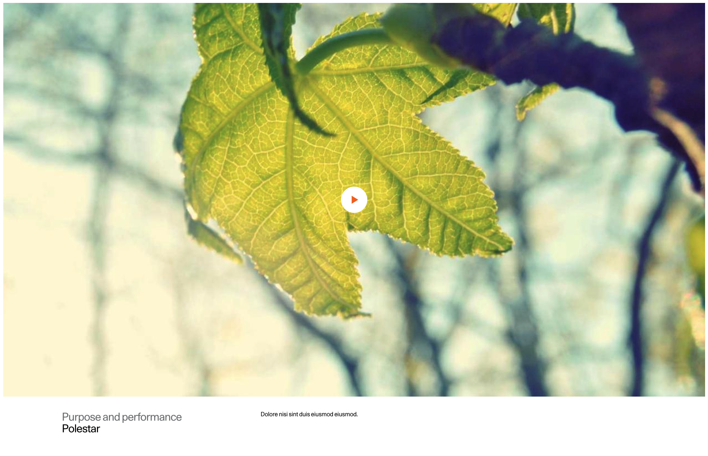
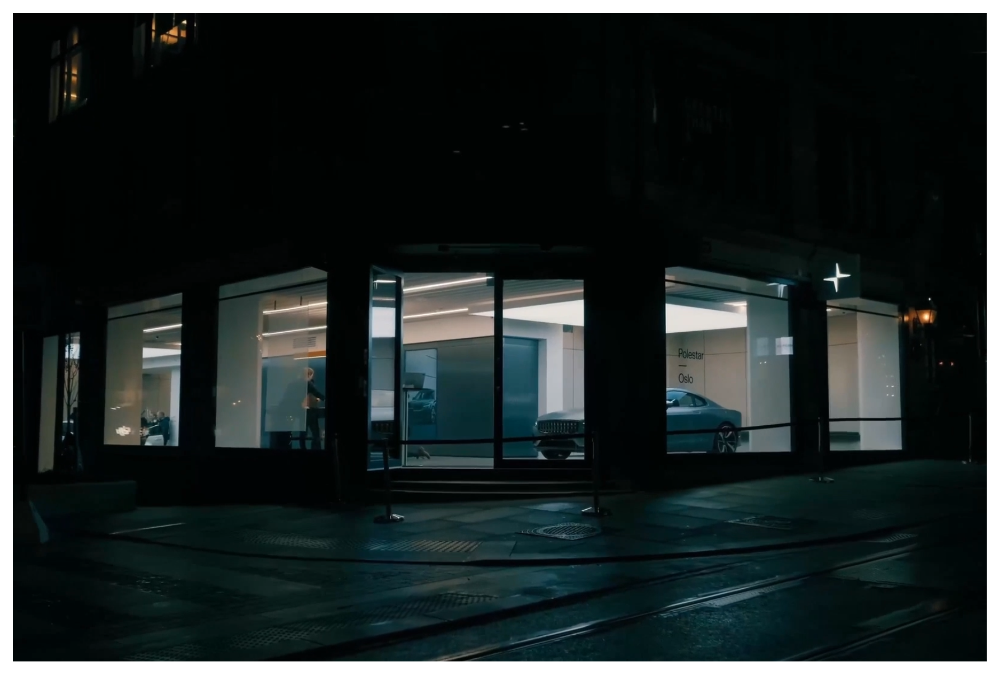
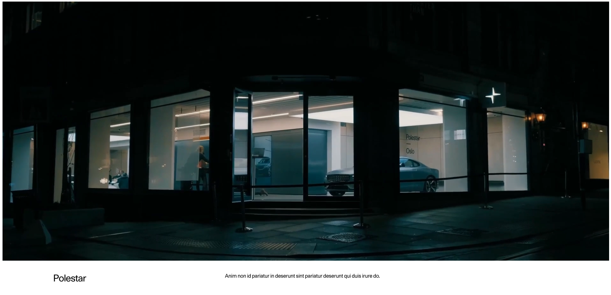

# SectionFullWidth
---
<!-- SectionFullWidth Storybook: http://localhost:6006/?path=/story/organisms-sectionfullwidthvideo--default -->

## Default

### Resolution and aspect ratio per device

| Device  | Aspect ratio | Width  | Height |
| ------- | ------------ | ------ | ------ |
| Desktop | 16:9         | 1600   | 900    |
| Tablet  | 16:9         | 960    | 540    |
| Mobile  | 16:9         | 768    | 432    |

---

## Compact

Tablet version missing. Should be added so that we can optimise the resolution for mobile.

Wiht the curremt implemeantaion a video that is sutible for both tablet and video has to be used.

There is a prop called `videoTablet` but it does not appear to be used.

| Device  | Aspect ratio | Width  | Height |
| ------- | ------------ | ------ | ------ |
| Desktop | 16:9         | 1600   | 900    |
| Mobile  | 16:9         | 960    | 540    |

---

## Expandable

Because this video will scale based on viewport height we should consider adding an additional video for large desktops, for example 1440p. On a 1440p displays the video will currently stretch beyond the current desktop resolution, causing it to become blurry.

| Device  | Aspect ratio | Width  | Height |
| ------- | ------------ | ------ | ------ |
| Desktop | 16:9         | 1920   | 1080   |
| Tablet  | 4:5          | 960    | 1200   |
| Mobile  | 9:16         | 432    | 768    |

---

## Cinematic

| Device  | Aspect ratio | Width  | Height |
| ------- | ------------ | ------ | ------ |
| Desktop | 21:9         | 1925   | 825    |
| Tablet  | 21:9         | 896    | 384    |
| Mobile  | 4:5          | 720    | 900    |

## Personal(?)