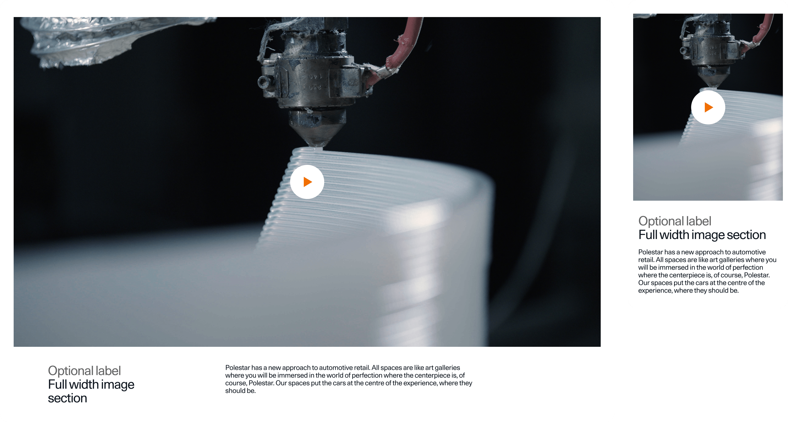
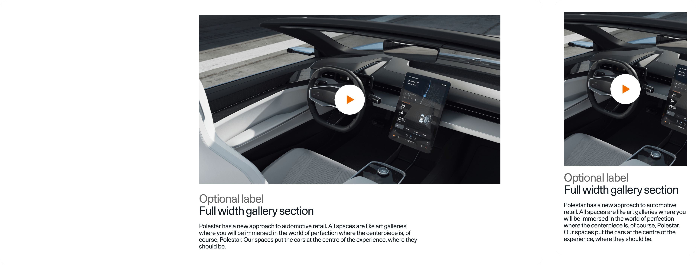
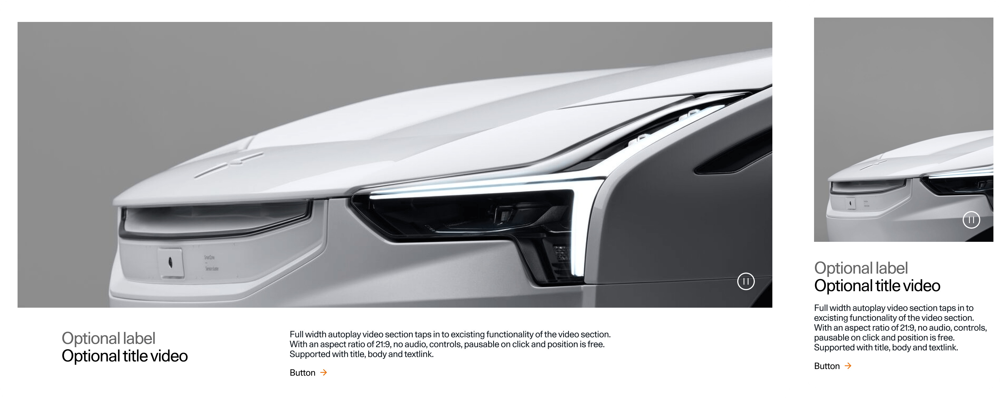
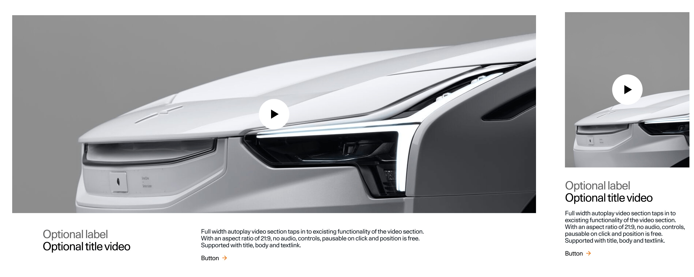

> ---
> ## 📚 Presets
>
> For downloading of presets and information on how to use them, consult [this guide](/docs/guides/presets/README.md).
> ---

# SectionFullWidthVideo

The purpose of a Section Full Width is to engage and inspire users. It serves as a way to showcase and highlight the key aspects, features, or capabilities in a visually compelling and engaging manner.

A Section Full Width can either be used with an Autoplay video or a Video player.

## Default

## 

<!--
SectionFullWidthVideo
Storybook: http://localhost:6006/?path=/story/organisms-sectionfullwidthvideo--default
-->

### Autoplay (without audio)

| Device  | Aspect ratio | Size        | File size threshold                   | Duration                    | Format | Autoplay | Audio |
| ------- | ------------ | ----------- | ------------------------------------- | --------------------------- | ------ | -------- | ----- |
| Desktop | 16:9         | 1920x1080px | 5-10MB, preferably in the lower range | Preferably under 10 seconds | .mp4   | Yes      | No    |
| Tablet  | 16:9         | 912x513px   | 5-10MB, preferably in the lower range | Preferably under 10 seconds | .mp4   | Yes      | No    |
| Mobile  | 16:9         | 720x405px   | 5-10MB, preferably in the lower range | Preferably under 10 seconds | .mp4   | Yes      | No    |

### Video Player (with audio)

| Device  | Aspect ratio | Size        | File size threshold                      | Duration | Format | Autoplay | Audio    |
| ------- | ------------ | ----------- | ---------------------------------------- | -------- | ------ | -------- | -------- |
| Desktop | 16:9         | 1920x1080px | No more than 15MB per minute of playback | Variable | .mp4   | No       | Optional |
| Tablet  | 16:9         | 912x513px   | No more than 15MB per minute of playback | Variable | .mp4   | No       | Optional |
| Mobile  | 16:9         | 720x405px   | No more than 15MB per minute of playback | Variable | .mp4   | No       | Optional |

---

## Compact

## 

<!--
SectionFullWidthVideo
Storybook: http://localhost:6006/?path=/story/organisms-sectionfullwidthvideo--compact
-->

### Autoplay (without audio)

| Device  | Aspect ratio | Size       | File size threshold                   | Duration                    | Format | Autoplay | Audio |
| ------- | ------------ | ---------- | ------------------------------------- | --------------------------- | ------ | -------- | ----- |
| Desktop | 16:9         | 1056x594px | 5-10MB, preferably in the lower range | Preferably under 10 seconds | .mp4   | Yes      | No    |
| Mobile  | 4:5          | 680x850px  | 5-10MB, preferably in the lower range | Preferably under 10 seconds | .mp4   | Yes      | No    |

### Video Player (with audio)

| Device  | Aspect ratio | Size       | File size threshold                      | Duration | Format | Autoplay | Audio    |
| ------- | ------------ | ---------- | ---------------------------------------- | -------- | ------ | -------- | -------- |
| Desktop | 16:9         | 1056x594px | No more than 15MB per minute of playback | Variable | .mp4   | No       | Optional |
| Tablet  | 4:5          | 680x850px  | No more than 15MB per minute of playback | Variable | .mp4   | No       | Optional |

---

## Expandable

## 

<!--
SectionFullWidthVideo - Expandable
Storybook: http://localhost:6006/?path=/story/organisms-sectionfullwidthvideo--expandable
-->

### Autoplay (without audio)

| Device  | Aspect ratio | Size        | File size threshold                   | Duration                    | Format | Autoplay | Audio |
| ------- | ------------ | ----------- | ------------------------------------- | --------------------------- | ------ | -------- | ----- |
| Desktop | 16:9         | 1925x1080px | 5-10MB, preferably in the lower range | Preferably under 10 seconds | .mp4   | Yes      | No    |
| Mobile  | 4:5          | 960x1200px  | 5-10MB, preferably in the lower range | Preferably under 10 seconds | .mp4   | Yes      | No    |

### Video Player (with audio)

| Device  | Aspect ratio | Size        | File size threshold                      | Duration | Format | Autoplay | Audio    |
| ------- | ------------ | ----------- | ---------------------------------------- | -------- | ------ | -------- | -------- |
| Desktop | 16:9         | 1925x1080px | No more than 15MB per minute of playback | Variable | .mp4   | No       | Optional |
| Tablet  | 4:5          | 960x1200px  | No more than 15MB per minute of playback | Variable | .mp4   | No       | Optional |

---

### TBD:

> Because this video will scale based on viewport height we should consider adding an additional video for large desktops,
> for example 1440p. On a 1440p displays the video will currently stretch beyond the current desktop resolution,
> causing it to become blurry.

---

## Cinematic

<!--
SectionFullWidthVideo - Cinematic
Storybook: http://localhost:6007/?path=/story/organisms-sectionfullwidthvideo--cinematic
-->

### Autoplay (without audio)

| Device  | Aspect ratio | Size       | File size threshold                   | Duration                    | Format | Autoplay | Audio |
| ------- | ------------ | ---------- | ------------------------------------- | --------------------------- | ------ | -------- | ----- |
| Desktop | 21:9         | 1925x825px | 5-10MB, preferably in the lower range | Preferably under 10 seconds | .mp4   | Yes      | No    |
| Tablet  | 21:9         | 896x348px  | 5-10MB, preferably in the lower range | Preferably under 10 seconds | .mp4   | Yes      | No    |
| Mobile  | 4:5          | 720x900px  | 5-10MB, preferably in the lower range | Preferably under 10 seconds | .mp4   | Yes      | No    |

### Video Player (with audio)

When the cinematic video is displayed as an video player (i.e. not atutoplay) image quality may be prioritized over file size. But it's still important to optimize as much as possible.

| Device  | Aspect ratio | Size       | File size threshold                      | Duration | Format | Autoplay | Audio    |
| ------- | ------------ | ---------- | ---------------------------------------- | -------- | ------ | -------- | -------- |
| Desktop | 21:9         | 1925x825px | No more than 15MB per minute of playback | Variable | .mp4   | No       | Optional |
| Tablet  | 21:9         | 896x348px  | No more than 15MB per minute of playback | Variable | .mp4   | No       | Optional |
| Mobile  | 4:5          | 720x900px  | No more than 15MB per minute of playback | Variable | .mp4   | No       | Optional |

## Personal(?)
