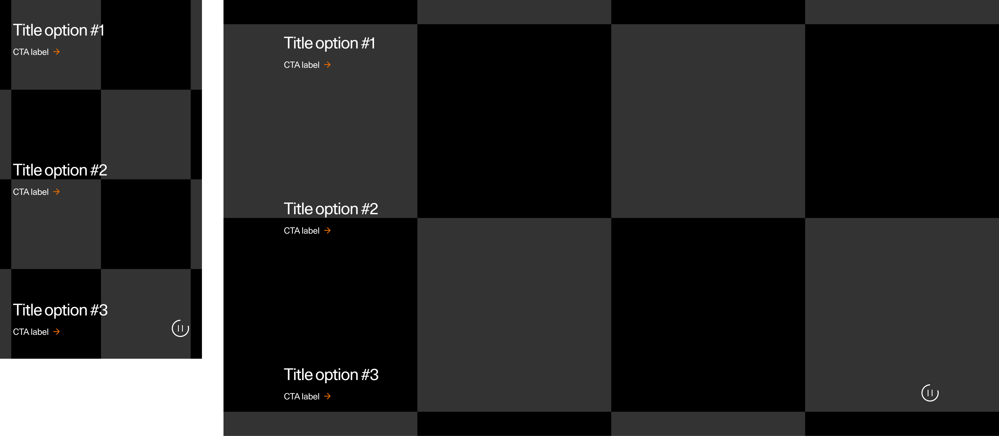

### SectionHighlight

The goal of the Highlight section on the homepage is to connect the hero section and the pinned news items. As part of a communication strategy, it involves using highly curated content that is linked to a campaign.

Strive to create a video with about 4 or 5 clips max (preferably less), keeping the edit not too fast-paced.

Depending on the negative space of the asset, the title can be displayed in one of the following three positions: top, center or bottom. The text is interchangeable based on timestamps and can be changed to all three positions. Please be aware that it is currently not possible to choose a different position for each breakpoint.

Ensure that the copy passes the accessibility tests by adjusting the video to be either dark or light enough in the specific areas.

Having the smallest file size possible is recommended. Experiment with different bitrate values and consider shortening the video if a desirable image quality cannot be attained within the file size threshold.

---
<!--
ScetionHighlight 
Storybook: http://localhost:6006/?path=/story/organisms-sectionhighlight--default-story
-->

| Device  | Aspect ratio | Size        | File size threshold                   | Duration                    | Format | Autoplay | Audio | Preset        |
| ------- | ------------ | ----------- | ------------------------------------- | --------------------------- | ------ | -------- | ----- | ------------- |
| Desktop | 16:9         | 1920x1080px | 5-10MB, preferably in the lower range | Preferably under 10 seconds | .mp4   | Yes      | No    | [Download](#) |
| Tablet  | 4:5          | 960x1200px  | 5-10MB, preferably in the lower range | Preferably under 10 seconds | .mp4   | Yes      | No    | [Download](#) |
| Mobile  | 9:16         | 774x1376px  | 5-10MB, preferably in the lower range | Preferably under 10 seconds | .mp4   | Yes      | No    | [Download](#) |
