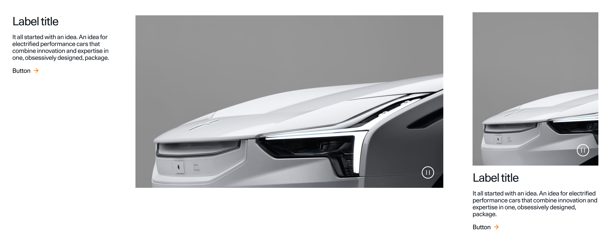
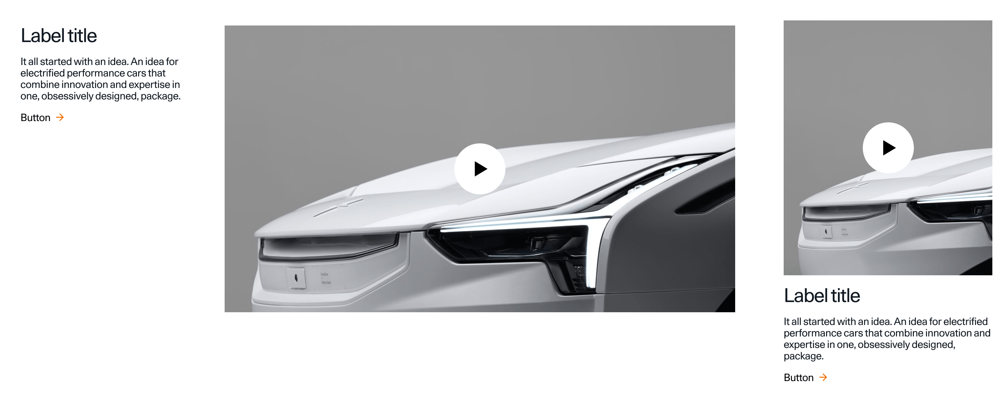

> ---
> 
> ## 📚 Presets
> 
> For downloading of presets and information on how to use them, cosult [this guide](/docs/guides/presets/README.md).
> 
> ---

# SectionOneVideo

### Autoplay

A *Section One Video* can either be used with an [Autoplay video](#autoplay-video) or a [Video player](#video-player).

<!--
SectionOneVideo
Storybook: http://localhost:6006/?path=/story/organisms-sectiononevideo--default
-->

| Device  | Aspect ratio | Size        | File size threshold                   | Duration                    | Format | Autoplay | Audio |
| ------- | ------------ | ----------- | ------------------------------------- | --------------------------- | ------ | -------- | ----- |
| Desktop | 16:9         | 1072x603px  | 5-10MB, preferably in the lower range | Preferably under 10 seconds | .mp4   | Yes      | No    |
| Tablet  | 16:9         | 544x306px   | 5-10MB, preferably in the lower range | Preferably under 10 seconds | .mp4   | Yes      | No    |
| Mobile  | 4:5          | 768x432px   | 5-10MB, preferably in the lower range | Preferably under 10 seconds | .mp4   | Yes      | No    |

#### Video player

| Device  | Aspect ratio | Size        | File size threshold                      | Duration | Format | Autoplay | Audio    |
| ------- | ------------ | ----------- | ---------------------------------------- | -------- | ------ | -------- | -------- |
| Desktop | 16:9         | 1072x603px  | No more than 15MB per minute of playback | Variable | .mp4   | No       | Optional |
| Tablet  | 16:9         | 544x306px   | No more than 15MB per minute of playback | Variable | .mp4   | No       | Optional |
| Mobile  | 4:5          | 768x432px   | No more than 15MB per minute of playback | Variable | .mp4   | No       | Optional |

