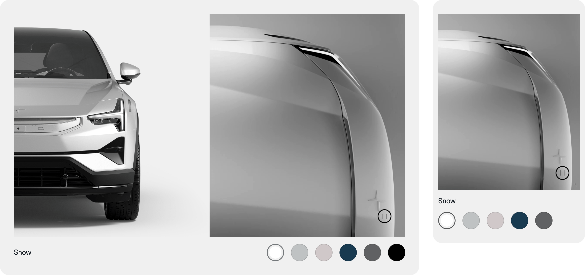

> ---
> ## 📚 Presets
>
> For downloading of presets and information on how to use them, consult [this guide](/docs/guides/presets/README.md).
> ---

# SectionSplitScreenCarouselSpecial

This section is used on the Feature pages where there is a video and image that are divided into two equally sized blocks.

## Slide

These video settings should be used for slides which are split in half. Half video, half text.

## 

<!--
SectionSplitScreenCarouselSpecial
Storybook: http://localhost:6006/?path=/story/organisms-sectionsplitscreencarouselspecial--default-story
-->

| Device  | Aspect ratio | Size      | File size threshold                   | Duration                    | Format | Autoplay | Audio |
| ------- | ------------ | --------- | ------------------------------------- | --------------------------- | ------ | -------- | ----- |
| Desktop | 4:5          | 600x750px | 5-10MB, preferably in the lower range | Preferably under 10 seconds | .mp4   | Yes      | No    |
| Tablet  | 4:5          | 436x545px | 5-10MB, preferably in the lower range | Preferably under 10 seconds | .mp4   | Yes      | No    |
| Mobile  | 1:1          | 680x680px | 5-10MB, preferably in the lower range | Preferably under 10 seconds | .mp4   | Yes      | No    |

---

## Full width video

These video settings should be used for slides which have a full widht video.

<!--
SectionSplitScreenCarouselSpecial
Storybook: http://localhost:6006/?path=/story/organisms-sectionsplitscreencarouselspecial--default-story
-->

| Device  | Aspect ratio | Size     | File size threshold                   | Duration                    | Format | Autoplay | Audio |
| ------- | ------------ | -------- | ------------------------------------- | --------------------------- | ------ | -------- | ----- |
| Desktop | 16:9         | 1120x630 | 5-10MB, preferably in the lower range | Preferably under 10 seconds | .mp4   | Yes      | No    |
| Tablet  | 16:9         | 864x486  | 5-10MB, preferably in the lower range | Preferably under 10 seconds | .mp4   | Yes      | No    |
| Mobile  | 1:1          | 656x656  | 5-10MB, preferably in the lower range | Preferably under 10 seconds | .mp4   | Yes      | No    |
