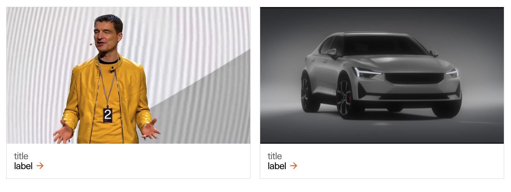

# SectionVideoCards

---
<!--
SectionVideoCards
Storybook: http://localhost:6006/?path=/story/organisms-sectionvideocards--default-story
-->

### Resolution and aspect ratio per device

At the moment this component only supports a single video for all devices.
With this in mind we've opted for a resoltion of `864x486px`, since it gives us the best balance in quailty and performance for the different devices.

| Aspect ratio | Size        | File size threshold                   | Duration                    | Format | Autoplay | Audio | Preset        |
| ------------ | ----------- | ------------------------------------- | --------------------------- | ------ | -------- | ----- | ------------- |
| 16:9         | 864x486px   | 5-10MB, preferably in the lower range | Preferably under 10 seconds | .mp4   | Yes      | No    | [Download](#) |
