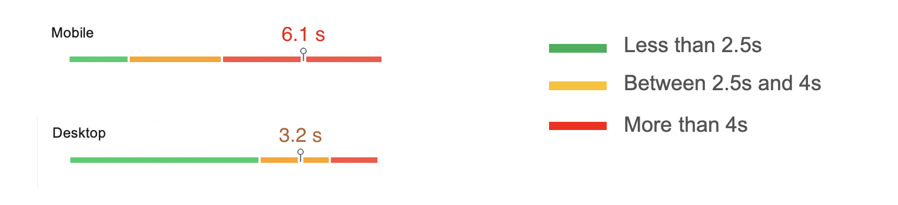
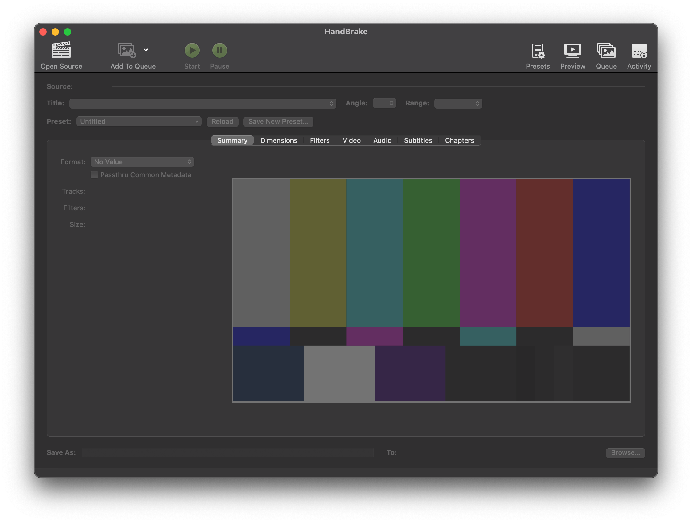
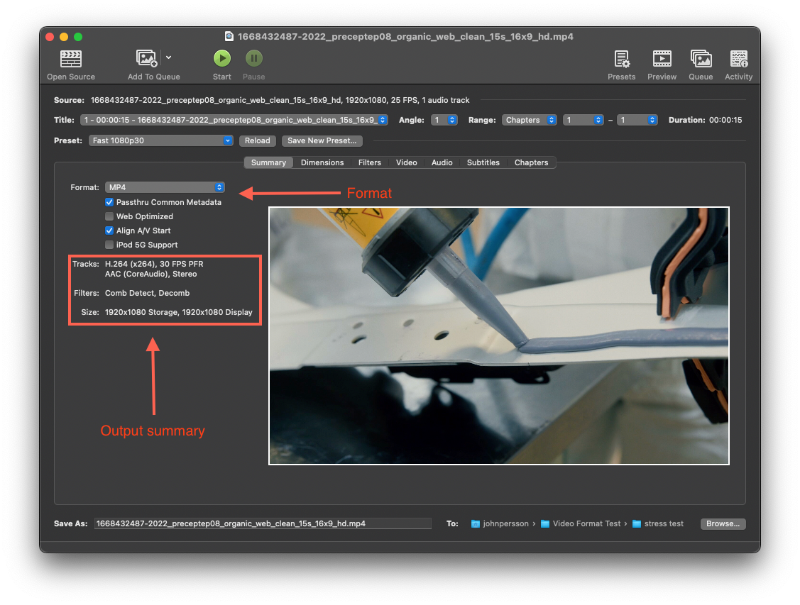
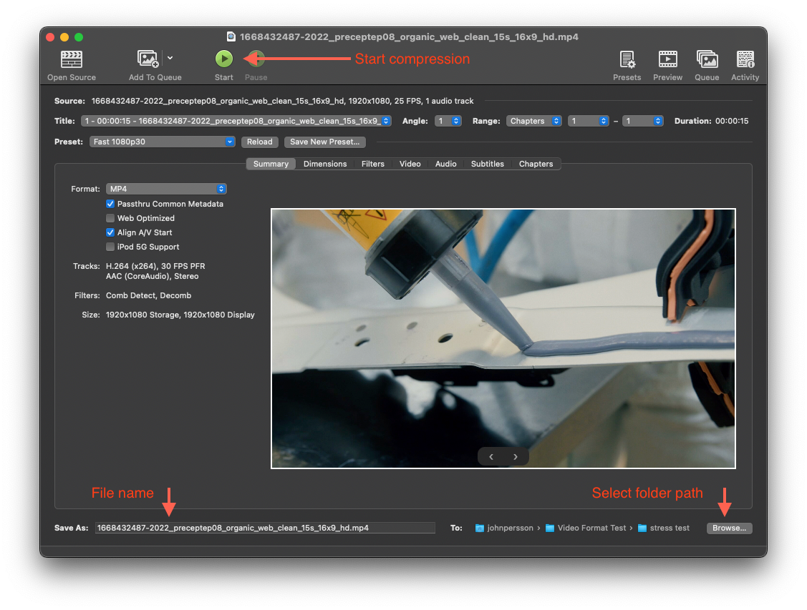
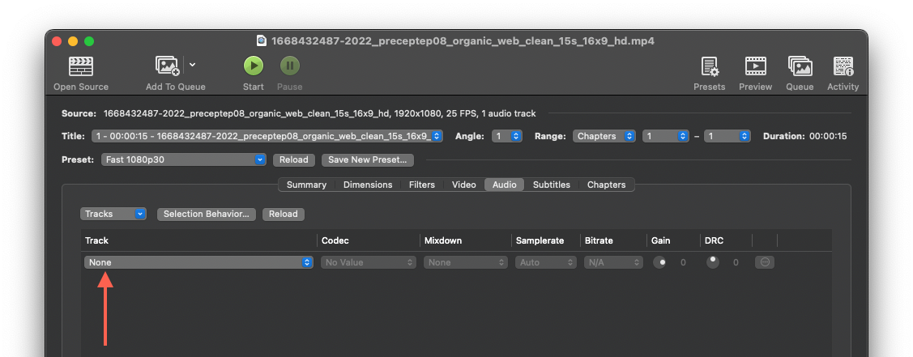
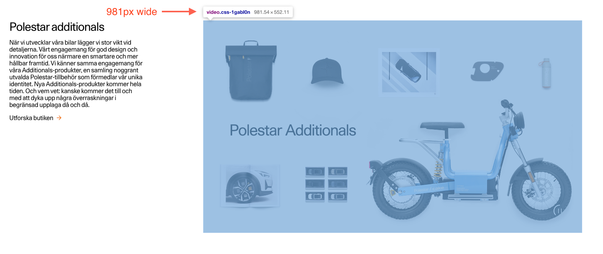

# Video optimisation guide

We receive assets from many different content providers. We cannot trust that these assets are ready to use as is, as we’ve seen in many cases that they haven’t been properly optimised for the web.

This guide is a first step in putting a process in place for video optimisation and to raise awareness on why this is important.

## Motivation

Big files effects loading times and overall performance. This is especially true when it comes to video, as they are in general bigger than other assets. It becomes very noticeable when you have to wait for them to finish loading before they can start playing.
It’s not uncommon that we have pages with multiple sections of large videos, and if not handled properly the total downloaded cost of these assets quickly adds up.

We need to take a collective responsibility and cater for all our uses. We need to regularly remind ourselves that all users that are visiting our site is not doing so on a desktop computer on a stable WiFi connection. We always need to keep the lowest denominator in mind, namely mobile devices on a flaky 3G connection.

Think twice about file size every time you upload a video in Dato, report any videos that does not follow our recommended [guidelines](#guidelines-and-thresholds)
and make sure that you or someone else takes action.

Unnecessarily big video files hurts our users and business in a couple of ways:

- Bounce rate: Long loading also equals a poor user experience. Every millisecond counts when we want to mitigate the risk of visitors getting frustrated and leaving.
  [Why does speed matter?](https://web.dev/why-speed-matters/)
- User resources: A users battery life and data plan is drained faster if we serve larger videos than necessary (true for all assets). Especially important when video is being autoplayed.
- Hosting: Hosting and serving files on Dato get’s more expensive every time we exceed our current data tier.

### A real life example

A measurement made on the Home Hero video revealed that ~50% of the mobile users needed to wait 4s or more for the video to load and 25% needed to wait 6.1s or more.

Time to video finish loading.

_These measurements were made from Web Vitals during November 2022 and only for users that does not have Safari, so in practise that is 50% of all visitors on polestar.com._

---

## The solution

Our current recommendation for video optimisation is HandBrake. [HandBrake](https://handbrake.fr/) is a free open source application that comes with reasonable default settings out of the box, which makes it easy to use even without prior knowledge on video compression.

Using HandBrake we have seen significant improvements, drastically lowering the file size of videos without a noticeable loss in image quality.

That being said, we will mention [recommended file size thresholds](guidelines-and-thresholds) further down in this article and methods to [further lower the file
size](#further-optimisations) if the threshold is exceeded.

---

## How to

When optimising a video you first need to make sure the video you’re working with hasn’t already been compressed. Compressing an already compressed video leads to poor image quality without necessary resulting in a smaller file size.

Either ask your content provider to follow this guide and deliver assets that follows it, or ask them for the best quality possible and optimise it yourself following the steps in the HandBrake section bellow.

You have probably seen images on the web (typically JPEGs) with really poor image quality and noticeable compression artefacts. This is often the result of the image haven been saved and compressed multiple times, making the image quality worse every time. The same is true when compressing videos.

When compressing a video it’s always a trade off between file size and image quality. Our goal is to find a sweet spot with the best image quality possible at a reasonable file size.

---

## HandBrake

Start by [downloading HandBrake](https://handbrake.fr/) for your OS of choice.
The rest of this guide will be using Mac OS, but you should be able to follow along no matter what OS you’re using.

We recommend using the default settings of HandBrake, which is is 1080p (HD) at 30fps.
This resolution and frame rate is a good trade of between image quality and file size, which should serve us well for most scenarios.
Our file format of choice (which is also the HandBrake default) is mp4. [Read more about why](#why-mp4-and-not-webm).

### Getting started

This is HandBrake. It might look a little intimidating when you first open it, but we will cover all the relevant tabs and settings.

Start by dragging and dropping the file you want to compress onto the application window (or click “File > Open Source…”).

### Smmery tab

Under the summary tab you will find a select box that says “format”. With “MP4” selected by default.

Bellow the select box and checkbox options you will see a summary of the output settings. Let’s unpack the things that are important to us.

### Tracks

“H.264” is the so called codec (or compression algorithm) used for compressing the video. “30fps” is the frame rate, 30fps = 30 frames per second.

“AAC (CoreAudio), Stereo” is the audio codec being used.

### Size

“1920x1080 Storage, 1920x1080 Display” describes the resolution. In other words, the video has a height of 1920 pixels a width of 1080 pixels. You might be more familiar with the term 1080p (or HD, which is the same as 1080p).

### Start the compression

Choose a file name and select a folder of where the file should be saves at the bottom of the application window, the Click the “Start”-button.

With the video we choose to use as an example in this guide, we started with an original file size of 38mb, and went to to 7.2mb. This is significantly better, but [we can do more](#further-optimisations).

---

## Further optimisations

We have covered the basics. Following the steps above you should now have an idea of how HandBrake can aid us in delivering optimised videos to our users.
So far we have stuck to the defaults, which in most cases may be enough, but bellow we will cover some more tweaks that can be done to further optimise our videos.

### Lower the bitrate of video

Arguably the biggest impact on file size can be archived by altering the bitrate of the video.

Bit rate is the amount of image information to be preserved per frame. By lowering the bit rate we can lower the file size, but If pushed too far (and depending on the content of the video) compression artefacts may start to become apparent and distracting to the viewer.

Here it becomes important to find a good balance between file size and image quality, by experimenting with different values and evaluate the result by watching the video.
A good rule of thumb is to always try to favour file size and not evaluate results based on selected frames. If we consider the video to looks good in motion to the average consumer, we have found a good balance.

### Removing the audio track

In a lot of cases we use video for decoration, as a background in various sections for example. In this case we typically autoplay the video and don’t want any audio. Select the “Audio”-tab and select the “none” option under “track”.

If the audio track of the source video is already muted this setting stil might reduce the total file size somewhat, since a muted audio track is still an audio track and takes up some amount of data. Its therefore a good rule of thumb to always use this setting every time audio is not needed.

### Reduce the resolution

We mentioned above that 1080p is the default resolution setting in HandBrake. However, in some cases this might be too much for what we actually need.

Take this video as an example. We know it will never be wider than 980px, so there is no need to export it at a width of 1920px (the width of 1080p/HD).

To fix this, go to the “Dimensions”-tab and change the “Resolution Limit” to “Custom”.
We wan’t to maintain the aspect ratio of the original video. To do this we will change the width to “1024” and height to “576“, this gives us an even 16:9 ratio (same as our source video) with a width closer to our target width of 980px.

As noted in the screen shot “Pixel Aspect” should be 1:1. This tells us that the video will be evenly scaled and maintain the aspect ratio of the original video.

By doing this we were able to reduce the file size to one third of the original file size.

To make the process of scaling videos to the correct resolution easier, we’re considering to create HandBrake presets and specifications (resolution, bitrate etc.) for all the videos used on the site.
By doing this the requirements of the video for every context/components will become more clear, and it should become easier to produce assets that match a certain criteria.

## Guidelines and thresholds

To ge a common idea of what is considered a “big video file”, we need to look at a couple scenarios in which video is being used today, and what challenges we face when it comes to optimisations under these particular circumstances.
It is important to keep in mind what context a particular video is being used in.

This is a living document and not an extensive list. It is subject to change and more scenarios may be added.

### Video as background

When video is being used as a background we face a couple changes:

- The video needs to load fast and start playing as soon as possible
- The desktop, the resolution of these videos are typically quite large, inherently leading to a bigger file size.
- Background videos are typically autoplayed and will tax the users dataplan and battery life without them taking an active choice in watching them.

Because of this the smallest file size possible is recommended. Experiment with different bit rate values and consider shortening the video if a desirable image quality cannot be attained within the file size threshold.

**File size threshold:** 5-10MB, preferably in the lower range.

### Video players

In the case of video players, the video is often triggered by an action from the user, (i.e. when clicking a play button). When this is the case image quality can be favoured over file size, but we should still strive to optimise as much as possible.
We have seen examples where uncompressed 4K (2160p) 60fps videos has been uploaded, when 1080p/HD 30fps probably would have been enough.

**File size threshold:** No more than 15MB per minute of playback.

---

## Why mp4 and not webm?

To make things easier for everyone involved with handling video asets, we have decided to start favouring the use of a single video format per video. In the past we have used a strategy of providing webm for the browsers that support it and mp4 as a fallback.

We did this with the assumption that mp4 was inferior to webm when it comes to file size and image quality. However, through testing we have found that the results varies a lot, and in the cases where webm does produce a better result, the difference to mp4 still isn’t significant enough to justify maintaining two video formats.

At the moment webm lacks support in Mobile Safari. When it becomes supported there should be nothing stopping us from start using mp4 and webm interchangeably, and choose the best format on a case by case basis.

For more background on this decision have a look at our conclusion in the comments sections of this ticket: [ PCOM-10473: Can we use only one video format (webm/MP4)? ](https://polestarjira.atlassian.net/browse/PCOM-10473) (link only accessible to Polestar employees).
